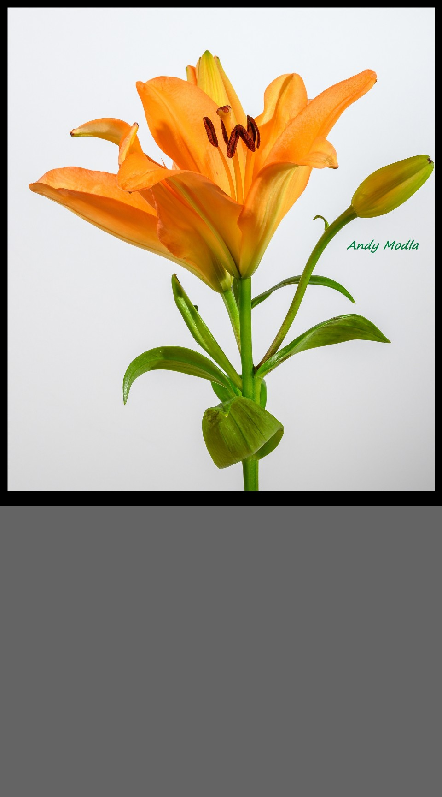
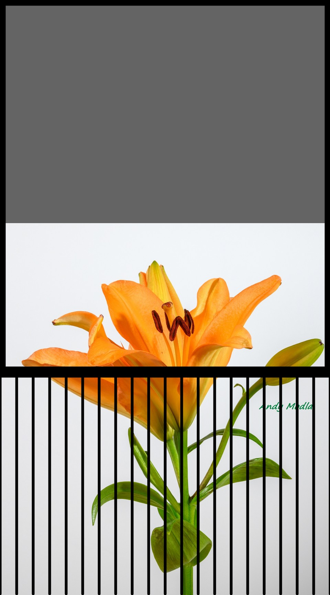

# Processing Sketches
Here are a few _Processing Sketches_ I wrote for public use, learning and experimentation.
For more about Processing see [Processing.org](https://processing.org/)

# Shred Photo Art

[Shred Photo Frame code is here](https://github.com/ajavamind/ProcessingSketches/tree/main/ShredPhotoFrame)

# Projects
Projects where I used Processing and saved in a repository are found here:

[Control multiple Samsung NX cameras with telnet commands](https://github.com/ajavamind/Multi-NX-Camera-Control)

[RCA Studio II and Studio III Home TV Programmer Emulator](https://github.com/ajavamind/rca-studio2)

[Stereo 3D Photo Rendering](https://github.com/ajavamind/StereoRenderExample)

[Retrieve Photo Files from Camera Photo HTTP Servers](https://github.com/ajavamind/GetFiles)

[Extract RCA COSMAC byte data (1976 cassette tapes) encoded in WAV audio file](https://github.com/ajavamind/Extract-WAV-Data)

[Conversion of Open Stereogram Project to Processing](https://github.com/ajavamind/OpenStereogram)

[Processing-Android Google Cardboard VR sketches](https://github.com/ajavamind/Processing-Cardboard)

[Processing Android Demo - How to embed processing sketch in your Android app](https://github.com/ajavamind/ProcessingAndroidDemo)

[Processing Android Telnet Twin NX500 cameras](https://github.com/ajavamind/ProcessingAndroidTelnetTwinNX500)

[Merge Transparent Photo Loop](https://github.com/ajavamind/MergeTransparentPhotoLoop)

# Android Mode Sketches

[Other sketches written for Android Mode](https://github.com/ajavamind/processing-android)

# YouTube Videos Created with Processing Code Sketches

  
[Shred Photo Art](https://youtu.be/zT58Xq-SjjI)  See code in ShredPhotoFrame folder.

[Shred Photo Art 3D Anaglyph](https://youtu.be/eS2jV-pJ1VI)

[3D Art Couture Fashion Exhibit](https://youtu.be/E1qOhr-95Xw)

[3D Art Couture Fashion Exhibit (half width)](https://youtu.be/v7Q8BkmMUdw)

[3D Children Readers Sculpture (Zoom in and out](https://youtu.be/5adfnIxg5yk)

[3D Flower Color Blending](https://youtu.be/yEtTXWjYyvc)

[Processing Blend Examples](https://youtu.be/cKkwaVFYCd4)

[Cat Yawn Photo Animation](https://youtu.be/tjVFPhWwpE0)

[Swords - RCA Arcade Game](https://youtu.be/xbSNnIyc1K4)

[Pond Raindrop Animation from Two Photos](https://youtu.be/biUsRet6-xI)

[Processing for Android Cardboard Demo App](https://youtu.be/zs7SNsNCpqA)

[Swarm3D Demo](https://youtu.be/90Q82x0HjRg)
 
